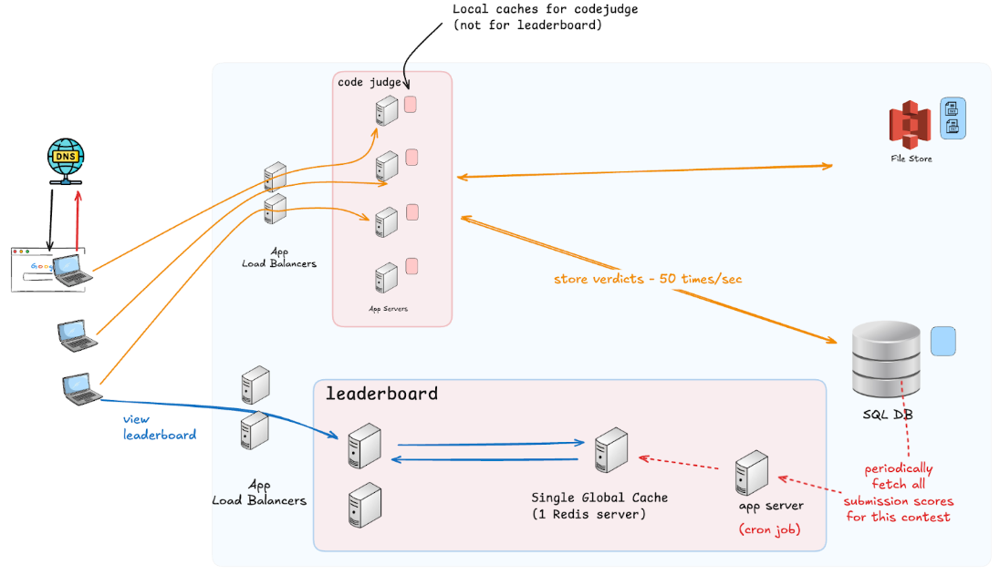

# Online Coding Contest Leaderboard - High Level Design

## 📌 Problem Statement
Design an online coding contest leaderboard similar to platforms like LeetCode or CodeChef. Whenever a user submits a solution, the leaderboard should update in near real-time.

## ✅ Clarifications
- Real-time rank updates after each submission.
- Single actor: **Participant**.

## ✅ Functional Requirements
- Display rank list on dashboard.
- Finalize contest at the end.

## ✅ Non-Functional Requirements
- High availability and scalability.
- Real-time updates with acceptable staleness.
- Caching for performance.

## 📊 Assumptions & Scale
- Participants: ~100k per contest.
- Duration: 3 hours.
- Problems: 5.
- Avg submissions/problem/participant: 2.
- Total submissions: ~1,000,000.
- Peak load: ~200 submissions/sec.

## 🧮 Ranking Algorithm
- Primary: Total score.
- Tie-breakers: Penalty time → earliest submission.

## 🗃️ Schema Design
- **Participants**: participant_id, name, email.
- **Contest**: contest_id, contest_name, duration.
- **Problems**: problem_id, name, difficulty.
- **Submissions**: user_id, contest_id, problem_id, score, time_taken.

## 🏛️ Architecture Diagram

## 🔍 API Endpoints
- `POST /submissions` → submit solution.
- `GET /leaderboard?contestId=123&page=1` → fetch paginated leaderboard.

## ⚡ Caching Strategy
- Global cache for top ranks.
- TTL or async refresh every 10 min.
- Pagination: 10 users per page.

## 🔐 Security
- Authentication & Authorization.
- Rate limiting.
- Anti-cheating measures.

## 📈 Observability
- Metrics: latency, cache hit rate, submission throughput.
- Logging & tracing.

## 🔄 Trade-offs
- Availability > Immediate consistency.
- Eventual consistency acceptable for leaderboard.

## 🚀 Future Enhancements
- Multi-region deployment.
- Real-time WebSocket updates.
- Personalized leaderboards.

---
### Original Notes Extracted from Document
- Contest Leader Board
- Problem Statement
- Design the online coding contest leader board. (May be extended for some other online contest also)
- Clarify the Problem Statement
- This is like the Leet-Code or Code-Chef kind of contest and when ever user submits the solution for the problem we need to show the leader board accordingly.
- Example
- Functional Requirements
- User should see Rank-list on the Dashboard (Real time)
- Finalize the Contest at the end
- Here there is only one actor : Participant
- Non-Functional Requirements
- After submission user should see the updated rank list on the dashboard
- Availability vs Consistency (Will discuss later)
- Is there is need of caching ?
- Is there is need of DB scaling ? and how to handle this?
- Requirement Gathering
- How many maximum number of participants will involve in contest?
- What is the duration of contest?
- How many questions will be asked?
- What is the way to determine the leader if there is tie between 2 participants?
- Like time taken to solve, or any penalty is being taken
- How many participants ?
- In the world 50 million people are coders and if I take 80 – 20 % rule then only 20% of them are active coders
- 50 * 0.2 = 10 million people
- But per contest active user might be 100k participants
- Duration of the contest is about 3hr
- 5 Question
- Avg submission / problem / participant = 2
- Total submission/problem will be 100k * 2 = 200k submission / problem
- Total 5 problems
- Total submission is = 1000k submission
- Avg submission / second is = 1000K / 3 * 3600 seconds =  1000k / 10^4 = 100 submissions / seconds
- Peak load = 2 * avg load = 200 submissions / seconds
- How to Compute the Rank-List ?
- High level Schema’s involved :
- Participants : participant_id, name, email, royalty_score
- Contest : contest_id, contest_name, contest_duration
- Problems : problem_id, problem_name, problem_difficutly, problem_description, time_complextiy, space_complexity
- Tests : test_id, test_name, test_case_url, test_level_difficulty
- Submission : user_id, contest_id, problem_id, problem_name problem_name, score, time_taken,
- Contest_user : joninng 2 tables
- Similarly other tables
- Mainly for computing the rank list we need to join the tables submissions, contest and problems and users mostly
- And roughly each record may have 200 bytes of memory
- Hence 1000k * 200 bytes = 200 MB for each contest and compute the rank list
- How frequently user see the rank-list ?
- If I assume every 10 min each user visit the rank-list then
- 20 views / user / 3hr
- So total views are = 100k * 20 = 2000k views / 3hr = 2000k / 10000 second = 200 views / seconds
- Each time if have to fetch 200 MB data to compute the rank list then it is load to the server hence there is need of cache
- And we can go for availability instead of consistency as it is okay to lag some time to update the rank-list but we need to show the data and serv 200 views / seconds
- For 100 + participants we can go for pagination and for each page we can show 10 users data
- Hence for each page it will be 2k data we need to fetch and 200 views / seconds we need to serv hence we can go for Global cache and at max we need to sore only 200 mb of data hence we can have Global Single Cache system.
- Is immediate consistency required?
No, It is okay to show the stale data for some of time
- What is the cache invalidation strategy ?
- TTL : we can have but if cache miss happens then computation is again costly. We can use this only if db fetch query is not complex
- Write Around : We can have asynchronous job that will run for every 10 min and update the cache 
But for initial 10 min we can have warm up data with all the participant as rank 1
- Cache will look like
- Contest:1:page:1 = [{participant’s data }..10 enties]
- Eviction Policy : No required here as per contest only max data is 200 MB
- Overall system Architecture looks like

