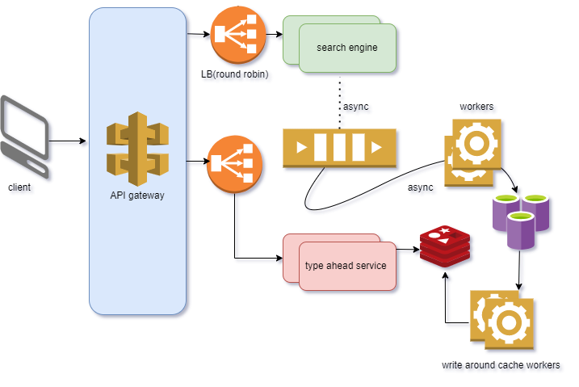

# ✨ Type Ahead Search — Scalable Design with Personality

> "Type three letters. Get ten smart guesses. Keep your flow." — This README shows **how to build it right**.

A creative yet practical guide to designing a **Type Ahead Search** system that feels instant, scales to millions, and stays maintainable.

---

## 🔥 TL;DR
- **Goal**: Return **Top‑10** relevant suggestions once a user types **≥ 3 chars** (≤ 20 chars).
- **Latency**: **p95 ≤ 100 ms** end‑to‑end.
- **Throughput**: ~**5,787 QPS** for ~**500M** requests/day (with debouncing).
- **Core**: Client **debounce → API Gateway → Suggestion Service → Redis ZSET**. DB for cache misses. Streaming pipeline to keep indices fresh.

---

## 🎯 Why This Matters
Type‑ahead reduces **time‑to‑result**, improves **conversion**, and surfaces **discoverability**. Done right, it saves backend resources and delights users.

---

## ✅ Requirements
- Show suggestions for prefixes of length **3–20**.
- **Debounce 250–300 ms** on the client to avoid request storms.
- Responses must be **context‑relevant**, **language‑aware**, and **safe** (filters/blocklists).
- Separate **read** (suggest) and **write** (search log) paths for availability.

---

## 🧭 UX Flow
1. User types: `wha…` → client waits ~300 ms (debounce).
2. Client calls `GET /app/v1/suggestion?q=wha&lang=en`.
3. Service hits **Redis ZSET**: `ZRANGE SUG:en:wha 0 9`.
4. **Cache hit** → return Top‑10.
5. **Cache miss** → read DB → warm Redis → return.
6. When user submits search, `POST /app/v1/search` emits an event for analytics & ranking.

---

## 📡 APIs
### `GET /app/v1/suggestion`
Query params:
```json
{ "q": "wha", "lang": "en", "k": 10 }
```
Response:
```json
{ "status": "success", "suggestions": ["what is the color of sky", "what is 2+2"], "error": null }
```

### `POST /app/v1/search`
Body:
```json
{ "query": "what is the color of sky?", "lang": "en", "userId": "optional" }
```
Response:
```json
{ "status": "success", "updateCount": 1, "error": null }
```

---

## 🧱 Data Model
- **queries**: `{ query: string≤100B, lang: string, total_count: int64, last_seen_ts: datetime }`
- **prefix_index**: `{ prefix: string, lang: string, topK: [ { query, score } ] }`
- **score** formula (example): `score = freq * time_decay + personalization_weight`
  - `time_decay` half‑life: **7–30 days** (choose per product cadence).

---

## 🧮 Sizing Math
- Daily suggestion calls: **≈ 500M** → `500,000,000 / 86,400 ≈ 5,787 QPS`.
- New queries/day: **≈ 50M** × **~200 bytes** ≈ **10 GB/day** → **~3.6 TB/year** pre‑compaction.
- Cache footprint: if a prefix record ≈ **200 B**, **16 GB Redis** holds **≈80M** keys (excluding overhead).

---

## 🏗️ Architecture (Visuals)
**PNG diagram for slides**:



**Component Diagram**
[Component Diagram](image1.png)


**Sequence Diagram**
[Sequence Diagram](image2.png)

---

## 🧰 Redis Key Schema (Example)
- Key format: `SUG:{lang}:{prefix}`
- Operations:
```text
ZRANGE SUG:en:wha 0 9           # read Top-10
ZADD   SUG:en:wha score query   # warm/update
EXPIRE SUG:en:wha 86400         # optional TTL
```
- Avoid hot keys: **salt prefixes** for ultra‑popular terms (e.g., `SUG:en:wha:#A`, `#B`) and aggregate.

---

## 🪵 Caching Strategy
- Prefer **ZSET** for ranked suggestions.
- **LRU + TTL** to control memory.
- **Proactive warming** after peak hours for popular prefixes.
- Track **hit ratio**; aim **> 90%** in steady state.

---

## 🧭 Sharding & Indexing
- **Consistent hashing** across shards for `queries` and `prefix_index`.
- Region‑local replicas for reads; async cross‑region replication.
- Batch rebuilds via stream pipeline to keep **Top‑K per prefix** current.

---

## 🧨 Failure Modes & Mitigations
- Cache node down → **graceful DB fallback**, reduce K (e.g., 10 → 5), and lean hints.
- DB shard hot → **split/salt popular prefixes**, back‑pressure via gateway.
- Event bus lag → **degrade to frequency‑only scoring** temporarily.

---

## 📏 SLOs & Observability
- Availability ≥ **99%**.
- p95 latency ≤ **100 ms**.
- Metrics: cache hit ratio, stream lag, shard load, 4xx/5xx per endpoint.
- Tracing: client → gateway → service → cache/DB; tag by **prefix length** & **region**.

---

## 🔐 Privacy & Safety
- No raw PII in logs; if personalization is enabled, **hash/anonymize** IDs.
- Retention: **30–90 days** for raw; keep aggregates beyond.
- Blocklists + ML filters to prevent unsafe suggestions.

---

## 🧪 Testing Playbook
- Load tests for p95/p99 latency at target QPS.
- Cache failure drills; DB fallback latency budget.
- Canary deploys; auto‑rollback on SLO breach.

---

## 🚀 Implementation Notes
- Suggestion Service can be **stateless** (horizontal scaling).
- Use **gRPC** for internal calls if polyglot; HTTP/JSON for public API.
- Store queries **normalized** (lowercase, trimmed, punctuation‑aware) with **language codes**.

---

## ❓FAQ
**Q: Why not Trie only?** Tries are fast but memory‑heavy; ZSETs + materialized Top‑K per prefix keep costs predictable.

**Q: How to personalize?** Blend global frequency with **user/topic embeddings** + recent interactions.

**Q: Multilingual?** Separate keys per language; add **transliteration** (e.g., Hinglish/Kannada ↔ English) in the index builder.

---

### Attribution
Crafted for system design storytelling. Includes both **Mermaid diagrams** and a **PNG** for decks.

